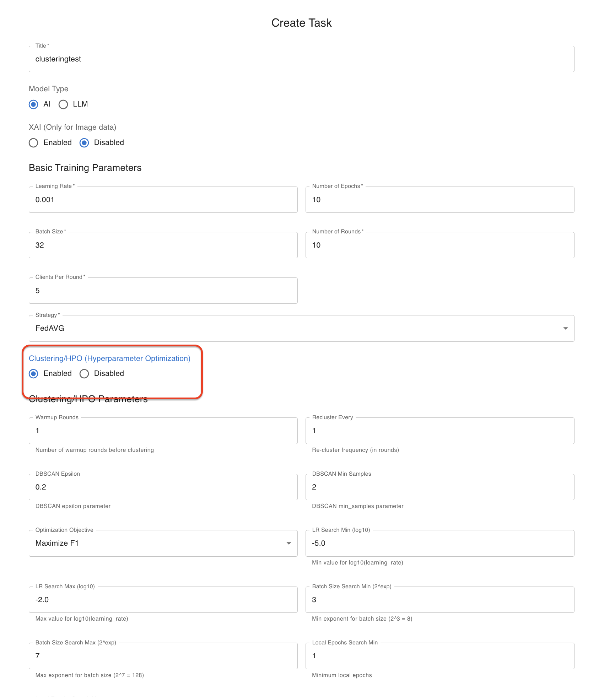
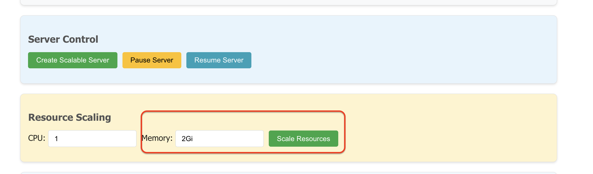
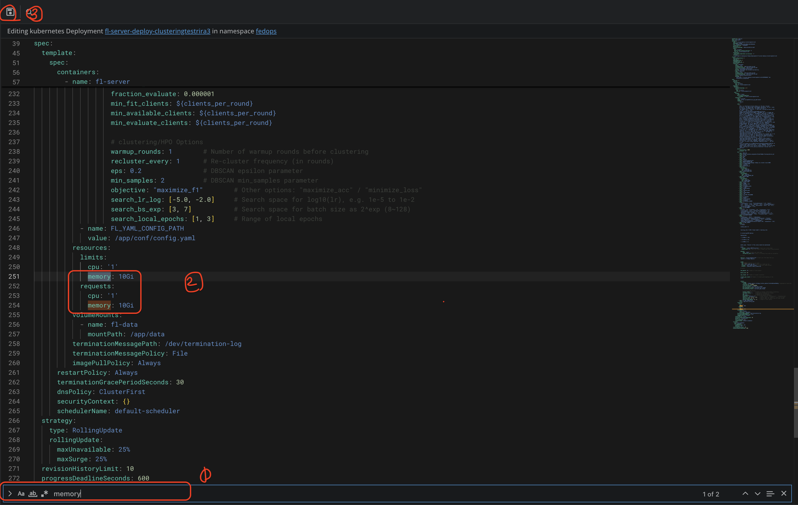
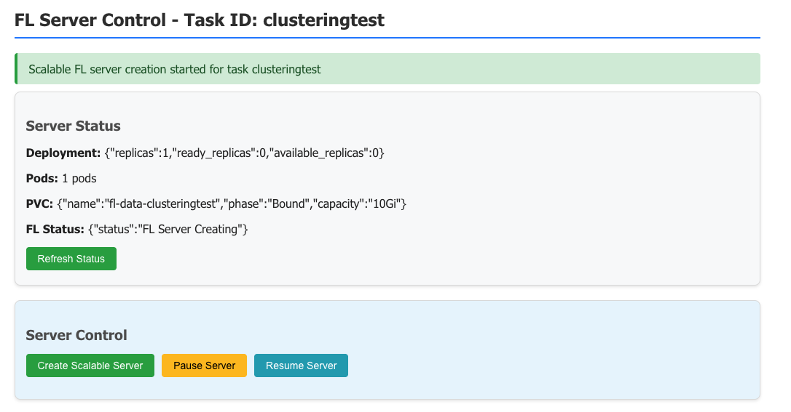
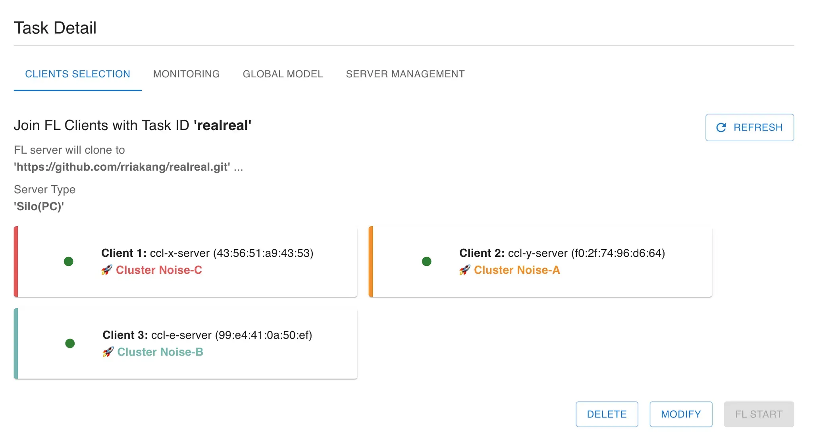

# FedOps Clustering + Optuna  
### Density-based Client Clustering for Robust Federated Learning under Non-IID Settings

---
## 💻 Why We Use This Method

Conventional Federated Learning (FL) performs well under IID conditions but fails to generalize efficiently in Non-IID environments due to the following issues:

1. **Single global model aggregation:**  
   Each client’s local model converges toward a different optimum due to heterogeneous data, causing degraded accuracy and unstable global updates.

2. **Static hyperparameters:**  
   A single hyperparameter configuration cannot adapt to diverse client characteristics, leading to suboptimal convergence.

To overcome these challenges, this method:

- Analyzes **model update patterns** via a **density-based clustering algorithm (DBSCAN)**.  
- Groups clients with **similar learning behaviors**.  
- Performs **Optuna-based hyperparameter optimization (HPO)** within each cluster.  
- Ensures **stable and adaptive global convergence** across heterogeneous clients.

This guide provides a step-by-step instruction on implementing the **FedOps Clustering + Optuna** workflow.

---

## 📂 Baseline Directory Structure

```

* Baseline

  * client_main.py
  * client_manager_main.py
  * server_main.py
  * models.py
  * data_preparation.py
  * requirements.txt
  * conf/

    * config.yaml

````

---
## ⚙️ Step 1: Clone FedOps

```bash
git clone https://github.com/gachon-CCLab/FedOps.git \
&& mv FedOps/hypo/usecase . \
&& rm -rf FedOps
````

---

## ⚡ Step 2: Create a Task (UI)

Enable **Clustering** and **Hyperparameter Optimization (HPO)** in your FedOps UI.

<p align="center">
  
</p>

**Key Parameters**

| Parameter             | Description                                                              |
| --------------------- | ------------------------------------------------------------------------ |
| `hyperparams`         | Initial hyperparameter candidates as `[learning_rate, batch_size]`.      |
| `ClusterOptunaFedAvg` | FedAvg variant combining clustering + Optuna HPO.                        |
| `warmup_rounds`       | Number of rounds before clustering starts.                               |
| `recluster_every`     | Number of rounds between each re-clustering.                             |
| `eps`                 | DBSCAN distance threshold for clustering.                                |
| `min_samples`         | Minimum number of clients to form a cluster.                             |
| `objective`           | HPO objective (e.g., maximize accuracy/F1 or minimize loss).             |
| `search_lr_log`       | Log-scale search range for learning rate (e.g., `[-5, -2]` → 1e-5~1e-2). |
| `search_bs_exp`       | Exponential search range for batch size (e.g., `[3, 7]` → 8~128).        |
| `search_local_epochs` | Search range for local epochs per client.                                |

---

## 🧠 Step 3: Set Memory to 10Gi

<p align="center">
  
</p>

If a **“socket closed”** error occurs:

1. Open **Lens** → **Deployments**.
2. Find your task’s deployment.
3. Click **Edit**, search for `memory`.
4. Change the value from `2Gi` → `10Gi`.

<p align="center">
  
</p>

---

## 🧩 Step 4: Create the Server

Create the server the same way as a standard FL setup.
No extra modification is required.

<p align="center">
  
</p>

---

## 🧪 Step 5: Non-IID Setup (`data_preparation.py`)

You can keep the same pipeline and simply use environment variables to control Non-IID modes.

Replace `/app/code/data_preparation.py` with the following code:

```python
import os
import json
import logging
from collections import Counter
from datetime import datetime

import torch
from torch.utils.data import DataLoader, Dataset, random_split, Subset
from torchvision import datasets, transforms

from fedops.utils.fedco.datasetting import build_parts

handlers_list = [logging.StreamHandler()]
logging.basicConfig(level=logging.DEBUG, format="%(asctime)s [%(levelname)8.8s] %(message)s",
                    handlers=handlers_list)
logger = logging.getLogger(__name__)

def _resolve_mode_from_env() -> str:
    code = os.getenv("FEDOPS_PARTITION_CODE", "0").strip()
    if code == "0":
        return "iid"
    elif code == "1":
        alpha = os.getenv("FEDOPS_DIRICHLET_ALPHA", "0.3").strip()
        return f"dirichlet:{alpha}"
    elif code == "2":
        n_labels = os.getenv("FEDOPS_LABELS_PER_CLIENT", "2").strip()
        return f"label_skew:{n_labels}"
    elif code == "3":
        beta = os.getenv("FEDOPS_QTY_BETA", "0.5").strip()
        return f"qty_skew:beta{beta}"
    else:
        logger.warning(f"[partition] Unknown FEDOPS_PARTITION_CODE={code}, fallback to iid")
        return "iid"

def load_partition(dataset, validation_split, batch_size):
    now = datetime.now().strftime('%Y-%m-%d %H:%M:%S')
    logging.info(f'FL_Task - {json.dumps({"dataset": dataset, "start_execution_time": now})}')

    num_clients = int(os.getenv("FEDOPS_NUM_CLIENTS", "1"))
    client_id   = int(os.getenv("FEDOPS_CLIENT_ID", "0"))
    seed        = int(os.getenv("FEDOPS_SEED", "42"))
    mode_str    = _resolve_mode_from_env()
    logging.info(f"[partition] mode={mode_str}, num_clients={num_clients}, client_id={client_id}, seed={seed}")

    transform = transforms.Compose([
        transforms.ToTensor(),
        transforms.Normalize((0.5,), (0.5,))
    ])

    full_dataset = datasets.MNIST(root='./dataset/mnist', train=True, download=True, transform=transform)
    targets_np = full_dataset.targets.numpy() if torch.is_tensor(full_dataset.targets) else full_dataset.targets
    parts = build_parts(targets_np, num_clients=num_clients, mode_str=mode_str, seed=seed)

    if not (0 <= client_id < num_clients):
        raise ValueError(f"CLIENT_ID must be 0..{num_clients-1}, got {client_id}")

    client_indices = parts[client_id]
    subset_for_client = Subset(full_dataset, client_indices)

    test_split = 0.2
    total_len = len(subset_for_client)
    train_size = int((1 - validation_split - test_split) * total_len)
    validation_size = int(validation_split * total_len)
    test_size = total_len - train_size - validation_size

    train_dataset, val_dataset, test_dataset = random_split(
        subset_for_client,
        [train_size, validation_size, test_size],
        generator=torch.Generator().manual_seed(seed + client_id)
    )

    train_loader = DataLoader(train_dataset, batch_size=batch_size, shuffle=True)
    val_loader = DataLoader(val_dataset, batch_size=batch_size)
    test_loader = DataLoader(test_dataset, batch_size=batch_size)

    def _count_labels(ds):
        if len(ds) == 0: return {}
        labels = [int(y.item()) if torch.is_tensor(y) else int(y) for _, y in ds]
        return dict(Counter(labels))

    logging.info(f"[partition] train_size={len(train_dataset)}, val_size={len(val_dataset)}, test_size={len(test_dataset)}")
    logging.info(f"[partition] train_label_hist={_count_labels(train_dataset)}")

    return train_loader, val_loader, test_loader

def gl_model_torch_validation(batch_size):
    transform = transforms.Compose([
        transforms.ToTensor(),
        transforms.Normalize((0.5,), (0.5,))
    ])
    val_dataset = datasets.MNIST(root='./dataset/mnist', train=False, download=True, transform=transform)
    return DataLoader(val_dataset, batch_size=batch_size)
```

---

## 🌐 Environment Variables

| Variable                   | Description                                                   | Default |
| -------------------------- | ------------------------------------------------------------- | ------- |
| `FEDOPS_PARTITION_CODE`    | `0`: IID, `1`: Dirichlet, `2`: Label-skew, `3`: Quantity-skew | `0`     |
| `FEDOPS_DIRICHLET_ALPHA`   | Dirichlet α                                                   | `0.3`   |
| `FEDOPS_LABELS_PER_CLIENT` | Number of labels per client (label-skew)                      | `2`     |
| `FEDOPS_QTY_BETA`          | Quantity-skew β                                               | `0.5`   |
| `FEDOPS_NUM_CLIENTS`       | Total number of clients                                       | `1`     |
| `FEDOPS_CLIENT_ID`         | Current client ID                                             | `0`     |
| `FEDOPS_SEED`              | Random seed                                                   | `42`    |

---

## 🔧 Examples

**IID Example**

```bash
export FEDOPS_PARTITION_CODE=0
export FEDOPS_NUM_CLIENTS=3
export FEDOPS_CLIENT_ID=0
```

**Dirichlet Non-IID (α = 0.3)**

```bash
export FEDOPS_PARTITION_CODE=1
export FEDOPS_DIRICHLET_ALPHA=0.3
export FEDOPS_NUM_CLIENTS=3
export FEDOPS_CLIENT_ID=1
```

**Label-Skew (2 labels per client)**

```bash
export FEDOPS_PARTITION_CODE=2
export FEDOPS_LABELS_PER_CLIENT=2
export FEDOPS_NUM_CLIENTS=5
export FEDOPS_CLIENT_ID=3
```

**Quantity-Skew (β = 0.5)**

```bash
export FEDOPS_PARTITION_CODE=3
export FEDOPS_QTY_BETA=0.5
export FEDOPS_NUM_CLIENTS=4
export FEDOPS_CLIENT_ID=2
```

---

## ✅ Result Example

<p align="center">
  
</p>

---

## 🧭 Notes

* Works out-of-the-box with existing FedOps pipelines.
* All Non-IID configurations are controlled via environment variables.
* Recommended: set `warmup_rounds > 0` before clustering begins.
* Tune `recluster_every` according to data drift frequency.

---

## ⚠️ Troubleshooting

| Issue                | Possible Cause              | Solution                                  |
| -------------------- | --------------------------- | ----------------------------------------- |
| Socket closed error  | Insufficient memory         | Set memory to 10Gi in Lens                |
| Empty client dataset | Too aggressive partitioning | Increase α or β; reduce clients           |
| Slow HPO             | Large search space          | Narrow `search_lr_log` or `search_bs_exp` |

---

