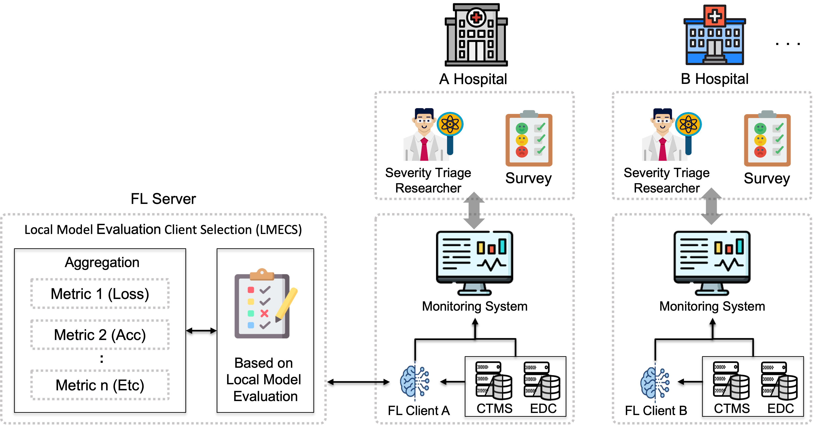

# FedOps Indutry Pack
FedOps can actually be used in many industries and provides usecases.

## Healthcare Domain
### FedOps Healthcare Usecase

- **Korean Emergency Room(ER) Data for Severity Analysis**: Analyzing patient severity using Korean NEDIS data.

- **Data Management Without Transfer**: Each institution independently utilizes its own data for analysis, avoiding data movement.

- **Local Model Training and Evaluating**: FL clients train/evaluate(test) models with this data, then report to FL Server.

- **Local Model Evaluation and Client Selection**: FL server assesses performance of local models for optimal global model creation.

- **LMECS in Multi-Institutional ERs**: Enhances early identification of high-risk patients without data movement.
