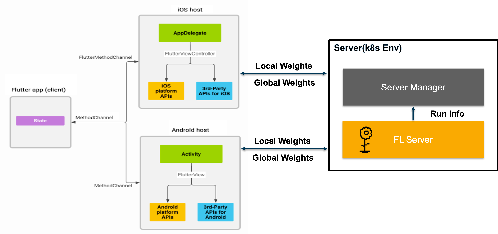
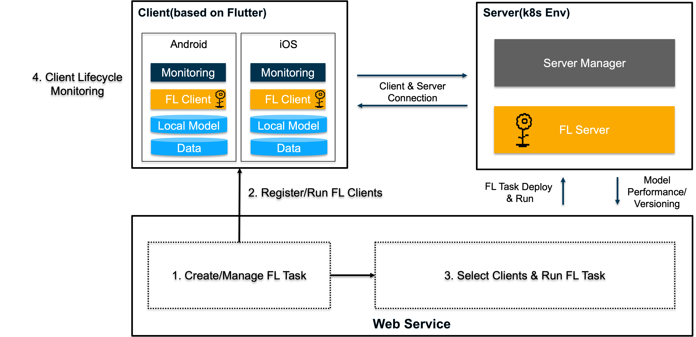

# FedOps Mobile

## Mobile Components

### FedOps Mobile based on Flutter

- Design FedOps Mobile UI with Flutter
- Android: on-device training based on Tensorflow Lite
- iOS: on-device training based on CoreML

## FedOps Mobile Scenario

### [Start FedOps Mobile](https://github.com/gachon-CCLab/FedOps/tree/main/mobile/examples)