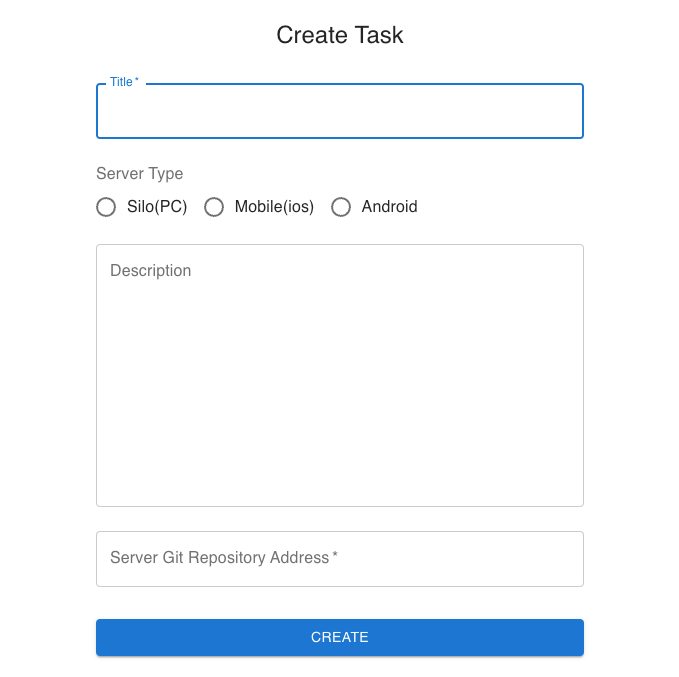
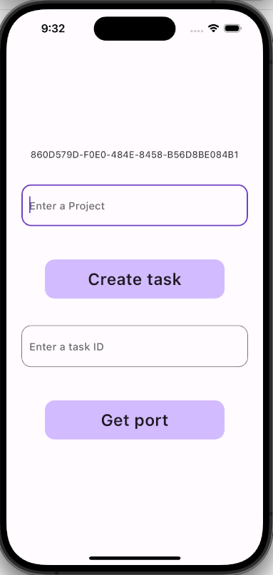

FedOpsMobile

This example represents a federated learning with mobile (Android&IoS) clients in a background thread. The Android dataset is done on a CIFAR dataset using Tensorflow lite.
The CIFAR10 dataset is randomly split across 10 clients. Each Android client holds a local dataset of 5000 training examples and 1000 test examples.
The FL server runs in Python but all the clients run on Android.
We use a strategy called FedAvgAndroid for this example.
The strategy is vanilla FedAvg with a custom serialization and deserialization to handle the Bytebuffers sent from Android clients to Python server.

How to use the code?

1. Install Flutter to your machine(you can follow the steps https://docs.flutter.dev/get-started/install).
2. Clone the project to AndroidStudio.
3. Run the project with your emulator (simulator for IoS) or you can connect your real device.
4. Go to FedOps platform (http://ccl.gachon.ac.kr/fedops) and create account.
5. Create new task. In order to do that you have to provide your github link for your server configuration.

6. Enter your task name to first text field in your mobile, then it makes port in FedOps platform. After that enter your task id to the second textField, server returns server configuration and server 
port.
.
7. Then you can start your federated learning.

