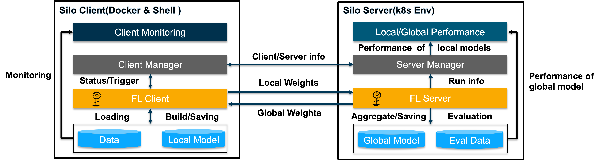
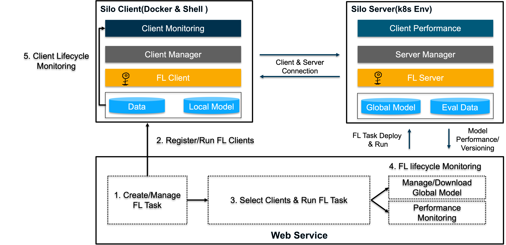

# FedOps Silo

## Silo Components

### Silo Client

- Support silo client env based on docker or shell file
- Check FL client status and occur trigger in manager
- Load data and build/save model in FL client
- Support silo client Dashboard for monitoring

### Silo Server
- Support silo server env based on k8s 
- Create and run FL server for starting FL rounds
- Monitor local/global model performance
- Manage/Save global model according to version

## FedOps Silo Scenario

### [Start FedOps Silo](https://github.com/gachon-CCLab/FedOps/tree/main/silo/examples/torch)
