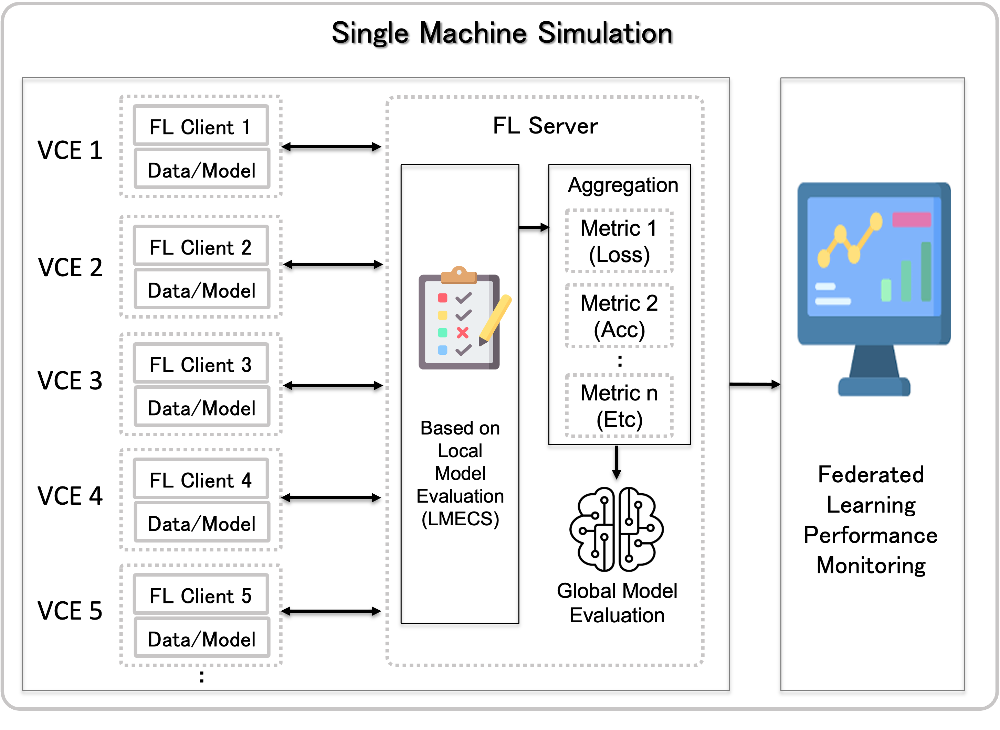

# FedOps Simulation

## FL Simulation on a Single Machine

<!--  -->

- For people who want to quickly use FL on a single machine

- Configure a client/server environment by allocating user-customized resources with Ray-based VirtualClientEngine. 
(Reconstruction using Flower Simulation)

- Apply custom data and models for FL

- Has a Client Selection function based on Local Model Evaluation

- Monitor model performance in real time

### [Start FedOps Simualtion](https://github.com/gachon-CCLab/FedOps/tree/main/simulation/examples)

